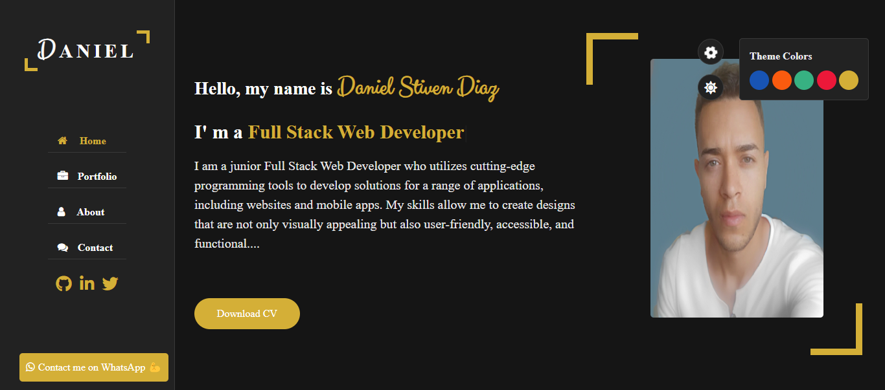

# 🌐 Mi Página Web Personal HTML, CSS, JavaScript

Este es el repositorio de mi página web personal, construida utilizando HTML, CSS y JavaScript puros.

## 🚀 Motivación y Objetivos

Decidí construir mi página web personal utilizando tecnologías básicas como HTML, CSS y JavaScript por varias razones:
- **Simplicidad**: Quería crear un sitio web sencillo y fácil de mantener.
- **Aprendizaje**: Esta fue una oportunidad para profundizar en mis conocimientos sobre estas tecnologías fundamentales.
- **Rendimiento**: Utilizar tecnologías ligeras contribuye a un mejor rendimiento del sitio web.

## 💻 Tecnologías Utilizadas

- HTML
- CSS
- JavaScript
- Iconos de [FontAwesome](https://fontawesome.com)

## 🌐 Instrucciones de Uso

Para ver mi sitio web personal, simplemente visita [mi sitio web](https://daniels35.com/).

## 📁 Estructura del Proyecto

La estructura del proyecto se organiza de la siguiente manera:

- Carpeta `css` que contiene una subcarpeta llamada `skins` donde defino cada uno de los colores a utilizar. La carpeta `css` contiene el archivo `style-switcher.css`, donde defino el menú para seleccionar la apariencia del sitio web, y por último el `style.css` donde están los estilos de toda la web.
- Carpeta `images` que contiene todas las imágenes del proyecto.
- Carpeta `js` que contiene todo el JavaScript que le da funcionalidad al proyecto.
- `index.html`
- `README.md`

## 📸 Capturas de Pantalla

  

¡Gracias por visitar mi página web personal! 😊
